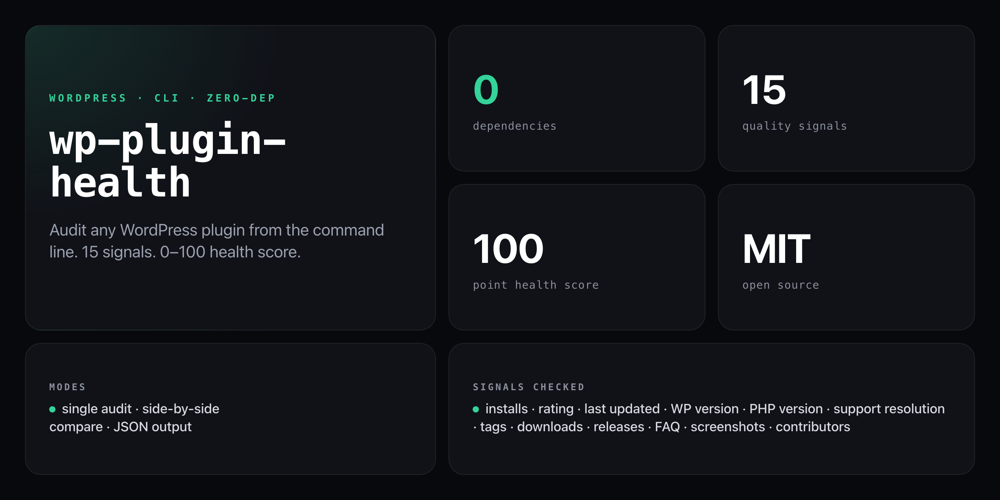

<div align="center">

**Instant WordPress plugin health reports from the command line. Zero dependencies. WP.org API data only.**


</div>

---

`wp-plugin-health` scores any WordPress.org plugin across 15 quality signals and returns a 0–100 health score — in under a second, straight from the WP.org Plugin Info API. No local install, no API keys, no rate limits.

```
WP PLUGIN HEALTH CHECK
━━━━━━━━━━━━━━━━━━━━━━━━━━━━━━━━━━━━━━━━

Plugin:  Akismet Anti-spam: Spam Protection
Author:  Automattic
Version: 5.3.4
Slug:    akismet

Health Score: ████████████████░░░░ 83/100

Vitals:
  ⭐ Rating:              4.4/5               ✅
  🗳️  Rating count:       956                 ✅
  📊 Active installs:    5M+                 ✅
  🔄 Last updated:       18 days ago         ✅
  🧪 Tested up to:       WP 6.7              ✅
  🐘 Requires PHP:       PHP 5.6             ⚠️  (Outdated PHP requirement)
  🎫 Support resolved:   91%                 ✅
  🏷️  Tags:               5 tags              ✅
  💰 Donate link:        No                  ⚠️
  ⬇️  Total downloads:    1,041,872,034       ✅
  📦 Releases:           43 versions         ✅
  ❓ FAQ section:        Yes                 ✅
  📸 Screenshots:        None                ❌
  👥 Contributors:       4                   ✅
  🔗 Compatibility data: None                ✅

Diagnosis: "Strong vitals. Could address: outdated php requirement."
```

## Install

No install, no npm account — runs straight from GitHub with zero dependencies:

```bash
npx github:NickCirv/wp-plugin-health akismet
```

## Usage

```bash
# audit a plugin by slug
npx github:NickCirv/wp-plugin-health akismet

# machine-readable JSON
npx github:NickCirv/wp-plugin-health akismet --json

# compare two plugins side by side
npx github:NickCirv/wp-plugin-health --compare akismet wordfence

# show help
npx github:NickCirv/wp-plugin-health --help
```

| Flag | Description |
|------|-------------|
| `--json` | Output full report as JSON (machine-readable) |
| `--compare <slug1> <slug2>` | Compare two plugins side by side |
| `--help`, `-h` | Show usage |

## The 15 health signals

| # | Signal | Weight | What's checked |
|---|--------|--------|----------------|
| 1 | Active installs | 10 | >10K good, >100K great |
| 2 | Star rating | 8 | Out of 5 stars |
| 3 | Rating count | 5 | Volume makes rating reliable |
| 4 | Last updated | 10 | <6 months ideal, >2 years flagged |
| 5 | Tested up to | 8 | Should match latest WP version |
| 6 | Requires PHP | 5 | PHP 8.0+ preferred |
| 7 | Support resolved % | 8 | >75% = healthy author responsiveness |
| 8 | Number of tags | 3 | 3–5 optimal for discoverability |
| 9 | Donate link | 2 | Signals maintenance commitment |
| 10 | Total downloads | 5 | Lifetime adoption |
| 11 | Release count | 5 | Activity and longevity |
| 12 | FAQ section | 4 | Documentation quality |
| 13 | Screenshots | 4 | UX investment |
| 14 | Contributors | 5 | Team vs solo maintainer |
| 15 | Compatibility data | 3 | Community compatibility signals |

## JSON output

```bash
npx github:NickCirv/wp-plugin-health akismet --json
```

```json
{
  "slug": "akismet",
  "name": "Akismet Anti-spam",
  "author": "Automattic",
  "version": "5.3.4",
  "score": 83,
  "signals": [
    {
      "key": "installs",
      "label": "Active installs",
      "value": "5M+",
      "score": 10,
      "max": 10,
      "status": "good",
      "note": null
    }
  ],
  "diagnosis": "Strong vitals. Could address: outdated php requirement."
}
```

## Technical details

- **Zero dependencies** — uses Node.js built-in `https` module only
- **Node.js 14+** — no transpilation, no build step
- **15s timeout** with `AbortController`-style destruction on hang
- **Graceful errors** for non-existent slugs
- Data sourced exclusively from the official [WP.org Plugin Info API](https://codex.wordpress.org/WordPress.org_API)

## What it is NOT

- **Not a linter or static analyser.** It audits live WP.org metadata, not plugin source code — it can't see code quality, security vulnerabilities, or licence compliance inside the plugin zip.
- **Not a guarantee.** Scores are heuristic. A plugin can score 90/100 and still have poorly written code; a new plugin scoring 45 may simply lack install history.
- **Not a replacement for manual review.** Use the score as a triage signal when evaluating plugins to adopt or maintain, not as the final word.

---

<div align="center">
<sub>Zero dependencies · Node 14+ · MIT · by <a href="https://github.com/NickCirv">NickCirv</a></sub>
</div>
